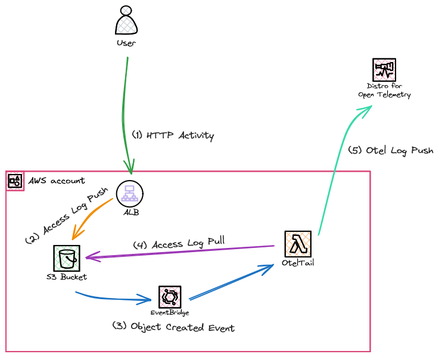

# Welcome to oteltail

Example of streaming S3 logs into a otel stack using a lambda based on a modified [promtail](https://github.com/grafana/loki/tree/main/tools/lambda-promtail/lambda-promtail).

At the time of writing opentelemetry go sdk logging support is still [in progress](https://github.com/open-telemetry/opentelemetry-go/pull/4955/files#) so I've borrowed heavily from a [separate PR](https://github.com/dagger/dagger/pull/6835) so provide a functional otel logging SDK.

## Architecture

The CDK stands up a sample ALB access logging system with triggers `oteltail` via eventbridge notifications.

The `oteltail` should be capable of ingesting all the datasources originally supported by promtail e.g. SNS, SQL , Kinesis etc. Modifications have also been made to allow the ingest of custom datasources i.e. arbitrary json logs , however parsing of these logs is limited and left as a exercise for the ingesting system.

## Useful commands

-   `make clean` remove any intermediate state
-   `make diff` compare deployed stack with current state
-   `make deploy ` deploy this stack to your default AWS account/region
